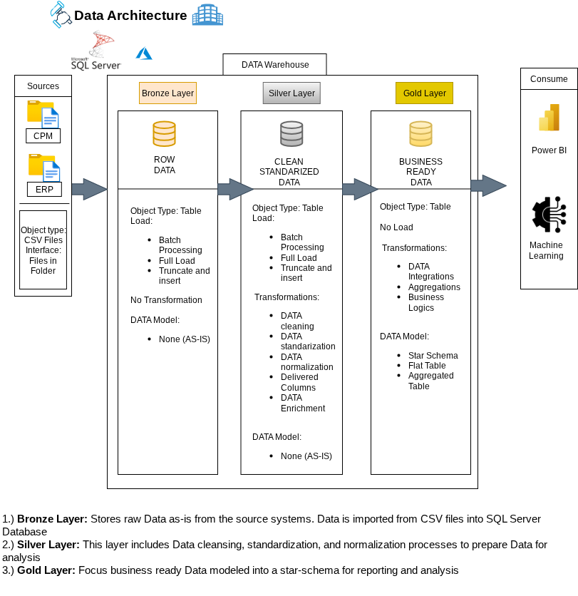

# Data Warehouse and Analytics project
Welcome to the Data Warehouse and Analytics Project Repository!
This project demonstrates a comprehensive data warehousing  and analytics solution, from
building a modern Data Warehouse with SQL Server to developing ETL processes, data modeling, and analytics.
This is designed as a portfolio project that highlights industry best practices in data engineering and analytics. 

Project requirements:

Building the Data Warehouse(Data Engineering)

Objective
Develop a modern data warehouse using SQL Server to consolidate sales data, enabling analytical reporting and informed decision making. 

Specifications
- Data Sources! Import data from two source systems (ERP and CRM) provided as CSV files
- Data Quality! Cleanse and resolve data quality issues prior to analysis.
- Integration! Combine both sources into a single, user-friendly data model designed for analytical queries.
- Scope! Focus on the latest dataset only; historization of data is not required.
- Documentation! Provide clear documentation of the data model to support both business stakeholders and analytics teams.

Analytics & Reporting(Data Analytics)

Objective
Develop SQL-based analytics to deliver detailed insights into:
- Customer Behavior
- Product Performance
- Sales Trends

These insights empower stakeholders with key business metrics, enabling strategic decision-making. 

About Me
Hello, Im Nenubari Bakpo, I am a preprofessional learning and applying my skills into some professional projects!

